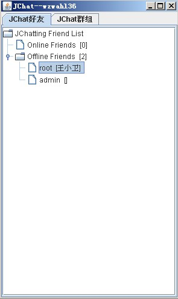
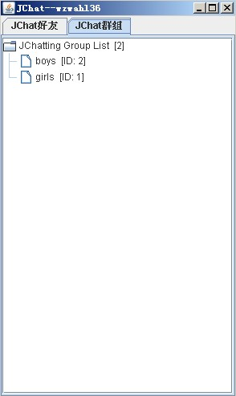
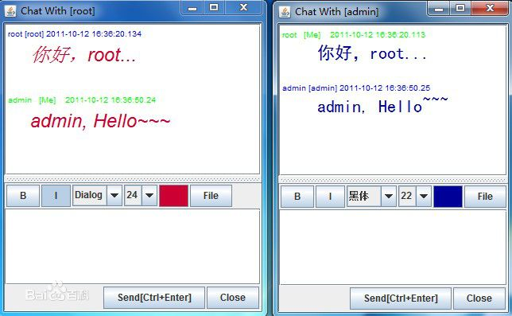
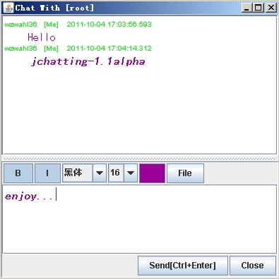

# jchatting

Chat system developed by Java Swing & Java Socket. 使用Java Swing和Java Socket API实现的聊天系统，包括点对点单聊、群聊、发送文件等，服务器扩展简单容易。

2011年十一长假的时候写的，当时是研一刚入学，Java水品一般。

代码之前托管在google code上，后来关闭之后也没有自动导入，现在有人经常问到要代码，所以从其他人自动导出的代码中上传到自己的Github上。

Google code上项目地址:[https://code.google.com/archive/p/jchatting/](https://code.google.com/archive/p/jchatting/)

## 功能介绍

提供如下功能：

1. 用户注册，单点登录；
2. http://my.oschina.net/wzwahl36/blog/32891好友添加、删除、修改；在线好友聊天，离线好友留言功能；
3. 好友上线离线即时更新或者提醒；
4. 创建、加入、退出Chat群；群聊功能；
5. 用户之间的文件发送功能（无文件大小限制）；
6. RSA加密，保证服务器信息安全；
7. 使用RMI技术扩展服务器，减轻单个服务器的负荷。

----------

Supplies：

1. Users registe & Single login;
2. Add、delete friend，refresh friend list；Chat with online friends, leave messages to offline friends;
3. Refresh soft interface or give tip to user when friend online or offline；
4. Create、enter、quit chat group，refresh group list and Chat in group；
5. Send & receive file between friends（No file size limitations）；
6. Encrypt using RSA；
7. Using RMI to add more server，reduce the load of single server.

## 部署参考（相关博客）

代码年代久远，我自己都不太清楚了，但是大体的实现原理还是知道的。

 - [http://my.oschina.net/wzwahl36/blog/32891](http://my.oschina.net/wzwahl36/blog/32891)

## Screenshot

截图都是从百度图片、google图片中找回来的。

## License

Under [MIT License](https://opensource.org/licenses/mit-license.php)